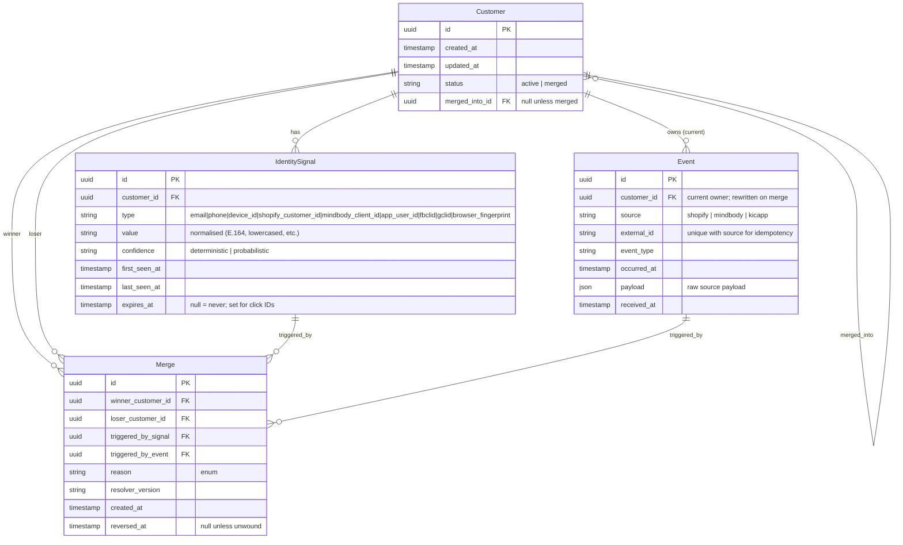

# Architecture

## 1. Problem Statement

Every business has different seasons, and KIC is currently transitioning from growth to expansion. In ecommerce, this is the season where a fragmented customer view stops being a backlog item and starts being a revenue ceiling.

KIC drives revenue through three distinct channels — E-Commerce (Shopify) and In-Studio (Mindbody) - and each system holds its own version of the customer. A member who buys an item online in Shopify, books a Reformer class in Mindbody, two different people to KIC. Email is unreliable as a canonical key: customers check out as guests, register under personal vs work addresses, and the same household frequently shares a device.

The commercial consequences of this is that 
- CLTV is undercounted because purchase and booking behaviour can't be combined
- Attribution leaks because the path from ad click to studio booking is broken, and re-engagement campaigns mis-target because "lapsed" is defined per-system rather than per-person. 

Industry benchmarks put the uplift from a working single customer view at **1.5–3× YoY on targeted CLTV cohorts** and a **~1.5× reduction in marketing spend waste** ([cdp.com](https://cdp.com/basics/cdp-use-cases/)).

The scope of this document is an **early-stage Single Customer View** for KIC, anchored on identity resolution and activation. Everything else (predictive segments, ML-driven LTV, real-time personalisation) is downstream of getting identity right.

---

## 2. Architecture Options

At KIC's stage, the platform choice that matters most is the one that's **cheap to reverse** — locking in the wrong CDP at expansion scale is more expensive than building the wrong thing in-house. 

**In-house build**
- **What:** Bespoke identity service — Next.js/Node, Postgres, a queue, reverse-ETL workers to Shopify/Mindbody — owning the `Customer` + `IdentitySignal` + `Event` model end-to-end.
- **Strength:** Full control over identity logic, which is the highest-risk part of any CDP and the part most likely to get KIC's shared-iPad and multi-email cases wrong if outsourced.
- **Weakness:** Every connector and every schema drift is an in-house incident; 6–12 months in, the team is effectively running a small CDP company on the side.
- **Cost shape:** Linear in headcount — predictable, but the FTE who owns it isn't building the next thing.

**Packaged CDP (Segment, RudderStack, mParticle)**
- **What:** Buy the stack — SDKs, server-side ingestion, identity graph, audience builder, destinations — and configure rather than build.
- **Strength:** Weeks-not-quarters to first activation, mature connector library, vendor carries the operational burden.
- **Weakness:** Identity logic is a black box, so the edge cases that matter most to KIC still need bolt-on logic or accepted false merges.
- **Cost shape:** Per-MTU pricing scales super-linearly with growth — costs spike with growth. 

**Composable CDP (Snowflake/BigQuery + Hightouch/Census/Fivetran)**
- **What:** Warehouse-native — Fivetran lands raw events, dbt models the identity graph in SQL, reverse-ETL activates downstream.
- **Strength:** Single source of truth for analytics, ML, and activation; identity logic is versioned, auditable SQL; portable to whichever activation tool wins next.
- **Weakness:** Requires a warehouse and a SQL-fluent team; activation latency is minutes-to-hours rather than real-time.
- **Cost shape:** Sub-linear — scales with warehouse efficiency rather than event volume.

### Total Cost of Ownership

These figures are example estimates. Figures are AUD, KIC-stage assumptions: low-single-digit-million MTUs, ~5 destinations, one senior engineer. 

| | In-house build | Packaged CDP | Composable CDP |
|---|---|---|---|
| **Time to value** | 4–6 months | 4–8 weeks | 2–4 months |
| **Year 1 TCO** | ~$200k | ~$180k | ~$200k |
| **Steady-state / yr** | ~$250k | ~$250k ↗ (rises with MTUs) | ~$220k |
| **Cost scaling** | Linear (FTE) | Super-linear (MTU) | Sub-linear (warehouse) |
| **Switching cost later** | Low | High | Lowest |
| **Operational burden** | High | Low | Medium |

The Year 1 numbers are deliberately close — within ~10% of each other — because the real TCO story is the **shape of the curve, not the starting point**. By Year 3 the packaged option is materially the most expensive (MTU growth compounds), in-house plateaus at the FTE line, and composable benefits from warehouse efficiencies the other two can't access. Switching cost is the under-discussed lever: a packaged CDP locks in event schemas and audience definitions, so the cost of being wrong shows up as a re-platform, not a line item.

### Recommendation — Stage it: Build → Composable

KIC has two needs on different timelines: solve identity resolution now to feel things, and converge on a warehouse-native customer model over the next 12–18 months as the system finds it fit. 

Phase 1 is an in-house identity service — this repo, productionised — owning `Customer`, `IdentitySignal`, `Event`, and merge provenance, with deterministic-first resolution and `device_id` flagged as probabilistic. 

Phase 2 pipes those outputs into a data lake (such as BigQuery or Clickhouse, or another OLAP Database) as the canonical `customer_profile`, with Hightouch/Census handling activation; the in-house service either retires or shrinks to a real-time ingestion shim. The packaged path is rejected at both stages because its MTU pricing curve punishes the growth KIC is targeting, and its black-box identity graph handles the shared-iPad and multi-email edge cases worst. The portability lever that makes this staged path work is that Phase 1's schema is designed from day one to land cleanly in a warehouse — Phase 2 becomes a pipeline change, not a re-platform.

**Staged-path TCO:** ~$200k Year 1, trending to ~$220–250k/yr steady state — the same envelope as any single-option choice, but with the option value of deferring the platform decision until KIC's data team and warehouse roadmap make it.

---

## 4. Data Model

The model has four tables and one rule that holds the whole thing together: **events reference the customer, never the signal.** Signals are mutable evidence; the customer is the canonical anchor; the event timeline must survive every re-resolution and merge without rewriting history.

**`Customer`** — the canonical record. Carries no PII directly; PII lives on `IdentitySignal` rows so it can be added, expired, or merged without touching the anchor. `merged_into_id` lets a loser row redirect to its winner rather than being deleted, so historical foreign keys still resolve and merges remain reversible.

**`IdentitySignal`** — typed edges between a customer and an identifier. The signal type (`email`, `phone`, `device_id`, `shopify_customer_id`, `mindbody_client_id`, `app_user_id`, `fbclid`, `gclid`, `browser_fingerprint`) carries its own confidence (`deterministic` / `probabilistic`) per [CONTRACTS.md](../CONTRACTS.md#section-3--identity-signal-inventory), and the `expires_at` column distinguishes stable platform IDs (no expiry) from short-lived click IDs (90-day TTL) — the same column, different policy per type. Unique constraint on `(type, value)` is what makes lookup O(1) and enforces "one signal value → one customer" globally.

**`Event`** — append-only source-of-truth log. `(source, external_id)` is unique for idempotency; `customer_id` is the *current* resolved owner, rewritten in place when a merge happens so the timeline at `/api/customers?q=…` stays correct without replaying history. The raw `payload` is preserved so schema drift in source systems is recoverable and resolver upgrades can re-derive signals from old events.

**`Merge`** — provenance for every unification. Records which signal and which event triggered the merge, which version of the resolver made the call, and leaves `reversed_at` nullable so a bad merge (two real people sharing an iPad) can be unwound without losing the audit trail. This is the table that makes the system reviewable rather than a black box.

**Why?**
- Shared-iPad case: `device_id` lands as a probabilistic signal — the resolver can require corroboration before merging, and the `Merge` row records the decision either way.
- Multi-email case: a customer accretes multiple `email` signal rows under one `Customer` rather than competing for a single column.
- Guest checkout: a `device_id`-only event still gets a `Customer` row immediately; later events with `email` or `phone` cascade-merge into it via the `Merge` log.
- Warehouse portability ([§3 Recommendation](#recommendation--stage-it-build--composable)): all four tables are flat, append-friendly, and have no ORM-specific types — Phase 2 reverse-ETL to BigQuery/Clickhouse is a pipeline change, not a re-platform.

---

## 5. Identity Resolution

Resolution is the moment the system commits to a position on "is this the same person?" Every later capability — CLTV, segmentation, attribution — inherits the false positives and false negatives baked in here. The resolver is therefore designed to be **deterministic-first, auditable, and reversible**: it prefers strong signals, records why it merged, and never destroys the loser row.

### 5.1 The resolution algorithm

For each ingested event ([`resolveAndIngest`](../src/lib/resolver.ts)), the resolver runs five steps inside a single transaction:

1. **Idempotency check.** `(source, external_id)` is the unique key on `Event`. A duplicate webhook returns the existing `customer_id` and short-circuits — no new row, no resolution work. This matters because Shopify and Mindbody both retry on 5xx, and the same order arriving twice must not create two profiles.
2. **Signal lookup.** Each extracted signal is looked up in `IdentitySignal` by `(type, value)`. Misses return null; hits return the owning customer, with merge chains followed transitively so a hit on a loser row resolves to its current winner.
3. **Customer selection.** The set of matched customers determines the path:
    - 0 matches → create a new `Customer`.
    - 1 match → use it.
    - 2+ matches with at least one deterministic signal → pick the **oldest** deterministic-matched customer as the winner. Oldest-wins is a tie-break, not a truth claim — it just makes the resolver order-independent: replaying the same events in any order produces the same winner.
    - 2+ matches from probabilistic signals only → also pick the oldest, but no merge is written; see §5.2.
    - Probabilistic-only matches when the event also carries a deterministic signal that didn't match anything → create a new customer rather than attach to a shared device. This is the shared-iPad guard.
4. **Event insert + signal attachment.** The event is written against the chosen `customer_id`. New signals are created; existing signals belonging to other customers are re-pointed to the winner (deterministic only — probabilistic ties don't move).
5. **Cascading sweep.** After attachment, the resolver scans the winner's deterministic signals for any that still collide with a different active customer, and merges in a loop until no collisions remain (§5.3).

**Worked example — collision (seed event #8, `shopify_order_004`):** Carol exists with `email=carol@example.com`; Bob exists with `phone=+61477777777`. The incoming order carries both. Step 2 returns matches against two different customers. Step 3 picks the older one (Bob) as winner. Step 4 writes the event against Bob and re-points Carol's email signal to him. Step 5 finds no further collisions and stops. One `Merge` row is written with `reason=deterministic_collision:email`. The seeded DB shows exactly this outcome.

### 5.2 Deterministic vs probabilistic signals

The `confidence` column on `IdentitySignal` is what lets the resolver treat "same phone" and "same iPad" differently. The split is per signal type ([`src/lib/signals.ts`](../src/lib/signals.ts)):

| Confidence | Signals | Why |
|---|---|---|
| Deterministic | `email`, `phone`, `shopify_customer_id`, `mindbody_client_id`, `app_user_id` | Each is issued or claimed by one person; collisions are real-world rare and almost always indicate the same human. |
| Probabilistic | `device_id`, `browser_fingerprint` | One device can belong to many people (a studio iPad, a shared household tablet, a refurbished phone). A match is evidence, not proof. |

Two behaviours flow from this:

- **Probabilistic signals never move.** When a probabilistic signal already belongs to customer A and a new event from customer B carries the same value, the signal stays with A. Both customers keep their separate profiles. The seed's guest-checkout scenario (`shopify_order_002`) demonstrates this resolving cleanly when only one customer is in play; if a second real person ever checked out from the same iPad, they'd land on a fresh profile rather than be silently fused into Jane's.
- **Probabilistic-only matches don't write a `Merge`.** The resolver attaches the event to the oldest matched customer (so the timeline isn't lost), but no provenance row is written, because there's nothing to review or reverse — no claim was made.

The corollary is that **a merge always has a deterministic signal as its trigger**. This is enforced by construction: every `Merge` row's `reason` references the deterministic signal type that caused it, and the corresponding `triggered_by_signal` is non-null.

### 5.3 Cascading merges

A single event can carry signals that don't just connect to one other profile — they can chain. The cascade handles this in a loop:

1. After the immediate merge, the resolver lists every deterministic signal now attached to the winner.
2. For each, it checks if any *other* active customer also holds that `(type, value)`.
3. If one is found, that customer is merged into the winner with `reason=cascading_merge:<signal_type>`, and the loop restarts.
4. Termination is guaranteed because each iteration strictly reduces the number of active customers.

When a loser is absorbed, its `Event` and `IdentitySignal` rows are re-pointed to the winner's `customer_id`, and the loser row is flipped to `status=merged` with `merged_into_id` set. **No history is rewritten.** The original event timestamps, payloads, and external IDs are intact; only the foreign key moves. This is what makes the unified `/api/customers?q=…` timeline correct after a merge without replaying anything.

The loser row is preserved on purpose. A `Customer` with `status=merged` is a forwarding pointer: foreign keys from external systems, audit logs, or downstream consumers that captured the loser ID before the merge still resolve, because `follow_merge_chain` walks `merged_into_id` transitively. This is also what makes a future reversal possible — see §5.4.

### 5.4 Merge provenance

Every merge writes one `Merge` row capturing:

- `winner_customer_id`, `loser_customer_id` — the decision.
- `triggered_by_signal` — the specific `IdentitySignal` row that caused the collision. Lets a reviewer see *which* email or phone was the link, not just that there was one.
- `triggered_by_event` — the event being ingested when the merge fired. Anchors the decision to a specific moment in the source-system timeline.
- `reason` — a short enum-style string: `deterministic_collision:email`, `cascading_merge:phone`, etc. Cheap to filter and aggregate.
- `resolver_version` — the version of the resolver ([`RESOLVER_VERSION`](../src/lib/resolver.ts)) that made the call. Critical when the rules change: rows written under v1.0.0 can be re-evaluated under v1.1.0 without ambiguity.
- `created_at` and `reversed_at` (nullable).

Reversal is a forward-only operation, not a delete: the loser row is restored to `status=active`, its events and signals are re-pointed back, and `reversed_at` is stamped. The original `Merge` row stays in place as the historical record. This is the property that makes the system *reviewable* rather than a black box — every merge can be inspected, queried by reason, attributed to a resolver version, and undone without losing the audit trail.

### 5.5 Signal lifetimes: stable IDs vs click IDs

The full KIC signal landscape spans two ends of a spectrum:

| Signal | Lifetime | TTL policy |
|---|---|---|
| `email`, `phone` | Long — change occasionally over a customer's life | No expiry; multiple values accrete on one profile |
| `shopify_customer_id`, `mindbody_client_id`, `app_user_id` | Stable per platform | No expiry; one value per platform per customer |
| `device_id`, `browser_fingerprint` | Medium — survives sessions, dies on reinstall/new device | No expiry, but probabilistic confidence (§5.2) limits damage |
| `fbclid`, `gclid` | Short — single ad click, attribution window only | **90-day `expires_at`** set at insert; resolver ignores expired rows in lookup |

The `expires_at` column on `IdentitySignal` is the single mechanism that handles this whole spectrum — same schema, different policy per type. Stable IDs leave it null and live forever. Click IDs are written with `expires_at = now + 90d` and are filtered out of `match_signals` once expired, so a re-used `gclid` six months later can't accidentally fuse two profiles. A scheduled job can hard-delete expired rows for storage hygiene without affecting resolver correctness, because the lookup already treats expired rows as absent.

This matters for KIC specifically because click IDs are the connective tissue between paid acquisition and in-studio booking — the path the current architecture leaks attribution on (§1). They need to participate in resolution during the attribution window, then disappear cleanly so they don't pollute the identity graph as the cookie ecosystem keeps degrading.

---

## 6. Failure Modes

A webhook service fails in predictable ways: the source retries, sends a malformed payload, or the resolver hits a state it can't reconcile. Each is handled as a first-class case, not an exception.

| Failure mode | Trigger | Containment |
|---|---|---|
| **Duplicate delivery** | Source retries on any non-2xx | Idempotency on `(source, external_id)` ([resolver step 1](../src/lib/resolver.ts)) — the duplicate returns the existing `customer_id` and short-circuits, so retries are safe and free. |
| **Malformed payload** | Schema drift, truncated JSON | Route handler returns **400** on bad JSON or a failed Zod parse ([`route.ts`](../src/app/api/webhooks/shopify/route.ts)) — a 400 tells the source *don't retry*, stopping a poison message from looping forever. |
| **Mid-resolution crash** | Process dies between writing the event and finishing a merge cascade | All of `resolveAndIngest` runs in one `prisma.$transaction` — event, signals, and `Merge` rows commit or roll back together, so provenance is never orphaned. |
| **Transient DB error** | Lock contention, connection drop | Handler returns **500** and logs `source`/`externalId`/`eventType` — a 500 tells the source *retry*, and idempotency makes that safe. |
| **Bad merge** | Two people share a device and get fused | Recovered, not prevented: probabilistic signals never trigger a merge ([§5.2](#52-deterministic-vs-probabilistic-signals)) and every merge writes a reversible `Merge` row ([§5.4](#54-merge-provenance)). |

The line across the table is **4xx vs 5xx as a retry contract**: bad input is the sender's problem (don't retry); anything past a valid payload is ours (retry into the idempotent path). That boundary turns a retrying source into a free at-least-once guarantee.

### 6.2 Logging, recoverability, observability

- **Structured logs** ([`logger.ts`](../src/lib/logger.ts)) — JSON via `pino`, correlated by a per-request `requestId`, with `email`/`phone` redacted at the logger so PII can't leak even when payloads are logged on error.
- **Replay over recovery** — the `Event` log is append-only and keeps raw payloads, so the worst case (rebuild the graph) is a replay: re-run the idempotent ingest path, no history rewritten. `resolver_version` on each `Merge` makes targeted re-resolution after a rule change possible. Backfill is thus a byproduct of the design, not separate machinery (productionising it is the main "with more time" item — see [NOTES.md](./NOTES.md)).
- **Resolution-quality observability** — the real question isn't "is the server up?" but "is the resolver merging the right people?" The `Merge` table answers it: queryable by `reason` and `resolver_version`, so a merge-rate spike surfaces a bad rule in SQL before a marketer notices. Metrics ([`metrics.ts`](../src/lib/metrics.ts)) are derived from the event log on read, so they can't drift from it.

**For production:** `/health` + `/ready`, RED metrics on the webhook routes, and a merge-rate anomaly alert — the single most important resolver-health signal. The instrumentation hooks exist; the gap is the exporter and dashboards.

---

## 7. Rollout Strategy

The phased rollout — staging the in-house service into production and the path from there toward the warehouse-native Phase 2 — is detailed in [IMPLEMENTATION_PLAN.md](./IMPLEMENTATION_PLAN.md).

---

## 8. We Missed You

The "We Missed You" re-engagement campaign — detecting lapsed customers from the unified event log and triggering activation — is detailed in [MISSED_YOU_PLAN.md](./MISSED_YOU_PLAN.md).
