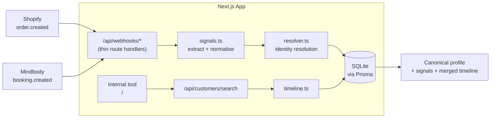

# KIC Single Customer View — Solution

A webhook ingestion service with a unified customer identity layer and an internal lookup tool.
Shopify and Mindbody events are ingested, resolved to a single canonical customer via shared
identity signals, and surfaced through a search-driven internal frontend.

For the design rationale see [ARCHITECTURE.md](./ARCHITECTURE.md); for assumptions and tradeoffs
see [NOTES.md](./NOTES.md).

## How it works



**Resolution flow.** A webhook arrives → the handler validates and persists the `Event`
(idempotent on `(source, external_id)`) → identity signals are extracted and normalised
(emails lowercased/trimmed, phones to E.164) → the resolver matches signals to an existing
`Customer` or creates one. Deterministic signals (email, phone, source IDs) outvote
probabilistic ones (`device_id`); when two customers collide on a deterministic signal they are
merged, with the older customer winning and a `Merge` row recording what triggered it.

The data model is four tables — `Customer`, `IdentitySignal`, `Event`, `Merge` — with the rule
that **events reference the customer, never the signal**, so the timeline survives every merge.
Full ER diagram in [ARCHITECTURE.md](./ARCHITECTURE.md#4-data-model).

## Running it

Requires Node (see [.nvmrc](../.nvmrc)) — run `nvm use` if you use nvm.

```bash
# 1. Env
cp .env.example .env

# 2. Install — peer-deps must be relaxed (Next 16 / React 19 peer ranges)
npm install --legacy-peer-deps

# 3. Database — apply the schema and generate the Prisma client
npm run db:migrate

# 4. (optional) seed sample customers, signals, and events
npm run db:seed

# 5. Run the dev server
npm run dev
```

The app runs at [http://localhost:3000](http://localhost:3000). Open `/` for the internal tool:
search by any signal (email, phone, device ID, Shopify customer ID, Mindbody client ID) to see
the resolved profile, its signals, and the combined order + booking timeline.

### Useful commands

| Command | What it does |
|---|---|
| `npm run dev` | Start the dev server |
| `npm test` | Run the unit tests (Vitest) |
| `npm run db:studio` | Open Prisma Studio to inspect the DB |
| `npm run db:reset` | Drop and re-create the local SQLite DB |
| `npm run db:seed` | Load sample data |
| `npm run lint` | Lint |

### Trying the webhooks

```bash
curl -X POST http://localhost:3000/api/webhooks/shopify \
  -H 'Content-Type: application/json' \
  -d '{ ... }'   # see CONTRACTS.md for payload shapes

curl -X POST http://localhost:3000/api/webhooks/mindbody \
  -H 'Content-Type: application/json' \
  -d '{ ... }'
```

Payload shapes, signal types, and resolution rules are documented in
[CONTRACTS.md](../CONTRACTS.md).
